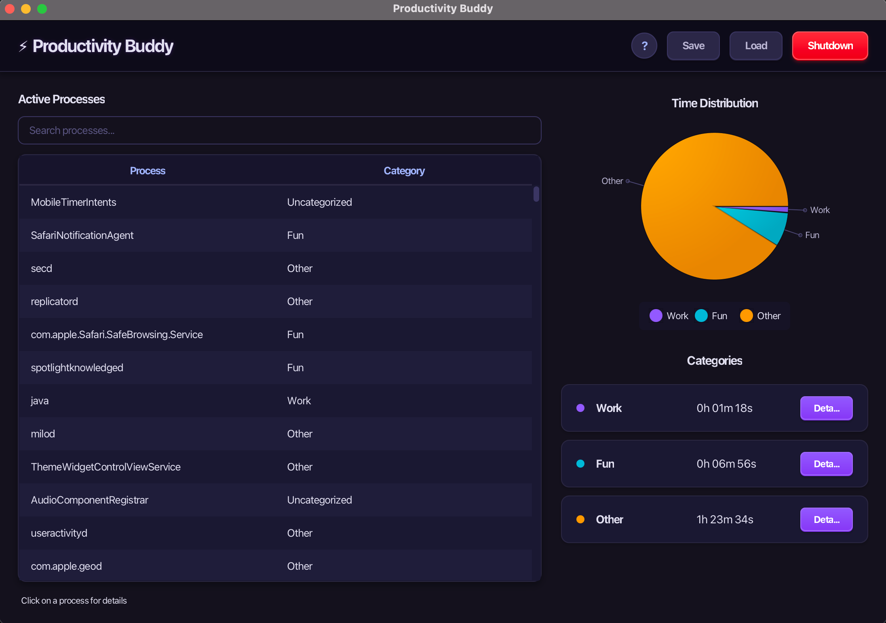

# Productivity Buddy

A JavaFX desktop app that tracks how much real time you spend in every running process — and, on macOS, in every browser tab broken down by domain. Built around a multi-threaded scanning architecture, rule-based auto-categorization, and persistent JSON/CSV snapshots.




---

## Features

- **Per-process time tracking** — wall-clock time each process has been alive, plus live CPU % and RAM, with PID-recycling detection so reused PIDs don't corrupt totals.
- **Per-browser-tab time tracking** (macOS) — AppleScript bridge enumerates open tabs and identifies the active tab for Chrome, Safari, Arc, Brave, Edge, Firefox, Vivaldi, Opera. Time is attributed per domain.
- **Rule-based auto-categorization** — regex rules in `config/categorization_rules.json` map process names and URLs to categories (`Work`, `Fun`, `Other`). Edit the file while the app is running and a `WatchService` hot-reloads it.
- **Live dashboard** — TableView of active processes, a category breakdown chart, drill-down views per process and per category, search/filter.
- **Persistence** — JSON save/load of user-assigned aliases and categories, periodic CSV snapshots (every `N` seconds plus at fixed wall-clock times).
- **Native installer** — `jlink` + `jpackage` produce a self-contained macOS `.dmg` with its own JRE; no system Java needed by the end user.

## Architecture

The app runs several concurrent components, each on its own thread, with the JavaFX Application Thread as the only writer of UI state.

```
                           ┌──────────────────────────────────────┐
                           │          ProcessRegistry             │
                           │ (ConcurrentHashMap<String,ProcInfo>) │
                           └──────────────────────────────────────┘
                                           ▲
              ┌────────────────────────────┼───────────────────────────┐
              │                            │                           │
   ┌──────────┴──────────┐      ┌──────────┴──────────┐    ┌───────────┴──────────┐
   │  Scanner-Scheduler  │      │  Analytics-Thread   │    │  FileWatcher-Thread  │
   │  (ScheduledExecutor)│      │  (2s cadence)       │    │  (java.nio WatchSvc) │
   │                     │      │                     │    │                      │
   │  every N ms:        │      │  aggregates time    │    │  hot-reloads:        │
   │    fork ScanTask    │      │  by category,       │    │   - process_info.json│
   │    ↓                │      │  computes top-10,   │    │   - categorization   │
   │  ForkJoinPool       │      │  Platform.runLater  │    │     _rules.json      │
   │   RecursiveAction   │      │  → UI refresh       │    │                      │
   │   (divide & conquer)│      │                     │    │                      │
   └─────────────────────┘      └─────────────────────┘    └──────────────────────┘
                                           │
                                ┌──────────┴──────────┐
                                │  Snapshot-Scheduler │
                                │  (every N sec)      │
                                │  + FileService      │
                                │  (async writes)     │
                                └─────────────────────┘
```

Key design notes:

- **Parallel scanning.** Each tick, `ProcessScanner` collects all live `ProcessHandle`s, then dispatches them to a `ForkJoinPool` via a custom `RecursiveAction` (`ScanTask`). The task recursively halves the process array down to a configurable chunk size; `fork()` the left half, `compute()` the right, `join()`. This gives genuine parallelism on multicore machines without a per-process thread.
- **Two-phase CPU accounting.** OSHI metrics (CPU % via tick deltas, RSS memory) are collected *once* per cycle from the main scan thread. Worker tasks only read from a `ConcurrentHashMap<Long, double[]>` — no contention, no OSHI API re-entry from worker threads.
- **Time-update once per `ProcessInfo`, not per `ProcessHandle`.** A single logical app (e.g. Chrome) may have 200 `ProcessHandle`s. Naively adding Δt per handle multiplies session time 200×. Instead, the scanner marks processes alive inside the `ForkJoinPool`, then walks the registry *once* after `invoke()` returns, adding elapsed seconds per `ProcessInfo`.
- **PID-reuse detection.** If a registered process name returns with a new PID *and* a different start-time, it's treated as a new session: previous session time is committed to `totalTime`, session counter resets.
- **UI thread safety.** `AnalyticsWorker` runs off-EDT, computes on private copies, writes to `volatile` fields, then schedules UI updates via `Platform.runLater`. All UI mutation happens on the JavaFX Application Thread.
- **Hot-reload of config.** `FileWatcherWorker` uses `java.nio.file.WatchService` to detect on-disk changes to `process_info.json` and `categorization_rules.json`, and reloads without restart.
- **Graceful shutdown.** On window-close, the app stops the scheduler and worker threads, awaits their termination, flushes pending writes through the `FileService` executor, and only then closes the stage.

## Tech stack

| Layer | Technology |
| --- | --- |
| Language / runtime | Java 21 |
| UI | JavaFX 21, ControlsFX, Ikonli |
| System metrics | [OSHI](https://github.com/oshi/oshi) 6.6 + `java.lang.ProcessHandle` |
| Concurrency | `ForkJoinPool` + `RecursiveAction`, `ScheduledExecutorService`, `WatchService` |
| Browser tab introspection | AppleScript (`osascript`) — macOS only |
| Build | Gradle 8, [javafxplugin](https://github.com/openjfx/javafx-gradle-plugin), [beryx.jlink](https://github.com/beryx/badass-jlink-plugin) |
| Packaging | jlink + jpackage (native `.dmg` on macOS) |

## Requirements

- **JDK 21** (the Gradle build enforces `sourceCompatibility = 21`).
- **macOS** for full functionality — browser-tab tracking relies on AppleScript. The rest of the app (process scanning, categorization, persistence) runs on Linux and Windows.
- On macOS, the first tab-enumeration attempt triggers a macOS *Automation* permission prompt per browser. Grant it once in *System Settings → Privacy & Security → Automation*.

## Build & run

```bash
# Clone
git clone https://github.com/vukasin-djuricic/productivity-buddy.git
cd productivity-buddy

# Run in dev mode
./gradlew run

# Build a runnable image
./gradlew jlink

# Build a native installer (macOS .dmg)
./gradlew jpackage
```

In dev mode, `config/` and `data/` are created next to the project root and seeded with defaults from `src/main/resources/defaults/`. In installed mode (`.app` bundle), they live in `~/Library/Application Support/ProductivityBuddy/`.

## Configuration

### `config/config.properties`

```properties
# Scanner cadence (ms)
monitor.interval=3000
# Where per-process state is persisted
mapping.file=data/process_info.json
# Periodic snapshot interval (seconds)
snapshot.interval=60
# Fixed wall-clock snapshot times (HH:mm:ss) — add as many as needed
snapshot.fixed_time_1=09:00:00
snapshot.fixed_time_2=18:00:00
```

### `config/categorization_rules.json`

Ordered list of `{ pattern, category }` rules. First match wins. The pattern is a case-insensitive Java regex matched against the process name *or*, for browser tabs, the full URL. Categories are `Work`, `Fun`, `Other`.

```json
{
  "rules": [
    { "pattern": "idea64|intellij|vscode|code|pycharm",     "category": "Work" },
    { "pattern": "chrome|firefox|safari|brave|edge|arc",    "category": "Fun"  },
    { "pattern": "github\\.com|stackoverflow|docs\\.oracle","category": "Work" },
    { "pattern": "youtube|netflix|twitch|reddit",           "category": "Fun"  }
  ]
}
```

Save the file — the running app picks up changes within one watch cycle.

## Project layout

```
src/main/java/org/productivity_buddy/
├── ProductivityBuddy.java         # JavaFX Application entry point + navigation
├── config/
│   ├── AppConfig.java             # typed access to config.properties
│   └── AppDirs.java               # dev vs. app-bundle base dir resolution
├── model/
│   ├── ProcessInfo.java           # per-process state (time, CPU, RAM, tabs)
│   ├── ProcessRegistry.java       # concurrent, categorization-aware registry
│   ├── ProcessCategory.java       # Work / Fun / Other / Uncategorized
│   └── TabInfo.java               # per-domain tab time
├── service/
│   ├── CategorizationService.java # regex-rule engine + hot-reload
│   ├── BrowserTabService.java     # macOS AppleScript bridge
│   └── FileService.java           # async JSON load/save + CSV snapshots
├── tasks/
│   └── ScanTask.java              # RecursiveAction: fork/join per-process work
├── workers/
│   ├── ProcessScanner.java        # periodic scan + ForkJoinPool dispatch
│   ├── AnalyticsWorker.java       # 2s aggregation loop → UI updates
│   └── FileWatcherWorker.java     # WatchService on config + state files
└── view/
    ├── MainChartView.java
    ├── SpecificCategoryView.java
    ├── ProcessDetailView.java
    └── NewHelpView.java
```

## License

MIT.
